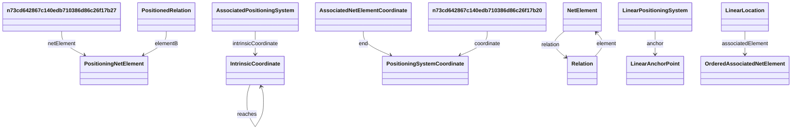

```mermaid
	classDiagram

    
    class PositioningNetElement {
    
    }

    class IntrinsicCoordinate {
    
    }

    class NetElement {
    
    }

    class PositioningSystemCoordinate {
    
    }

    class Relation {
    
    }

    class PositionedRelation {
    
    }

    class AssociatedNetElementCoordinate {
    
    }

    class AssociatedPositioningSystem {
    
    }

    class LinearPositioningSystem {
    
    }

    class LinearLocation {
    
    }


AssociatedPositioningSystem  --> IntrinsicCoordinate   :intrinsicCoordinate  

n73cd642867c140edb710386d86c26f17b27  --> PositioningNetElement   :netElement  

IntrinsicCoordinate  --> IntrinsicCoordinate   :reaches  

PositionedRelation  --> PositioningNetElement   :elementB  

AssociatedNetElementCoordinate  --> PositioningSystemCoordinate   :end  

NetElement  --> Relation   :relation  

Relation  --> NetElement   :element  

LinearPositioningSystem  --> LinearAnchorPoint   :anchor  

n73cd642867c140edb710386d86c26f17b20  --> PositioningSystemCoordinate   :coordinate  

LinearLocation  --> OrderedAssociatedNetElement   :associatedElement  

```