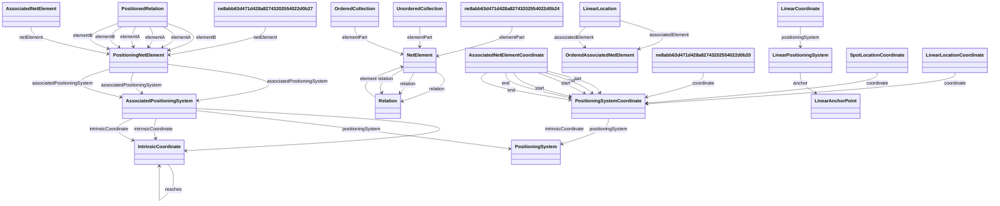

```mermaid
	classDiagram

    
    class PositioningNetElement {
    
    }

    class IntrinsicCoordinate {
    
    }

    class NetElement {
    
    }

    class PositioningSystemCoordinate {
    
    }

    class Relation {
    
    }

    class PositionedRelation {
    
    }

    class AssociatedNetElementCoordinate {
    
    }

    class AssociatedPositioningSystem {
    
    }

    class LinearPositioningSystem {
    
    }

    class LinearLocation {
    
    }


AssociatedNetElementCoordinate  --> PositioningSystemCoordinate   :start  

NetElement  --> Relation   :relation  

PositionedRelation  --> PositioningNetElement   :elementB  

ne8abb63d471d428a82743202554022d0b20  --> PositioningSystemCoordinate   :coordinate  

PositioningNetElement  --> AssociatedPositioningSystem   :associatedPositioningSystem  

ne8abb63d471d428a82743202554022d0b24  --> NetElement   :elementPart  

PositionedRelation  --> PositioningNetElement   :elementA  

IntrinsicCoordinate  --> IntrinsicCoordinate   :reaches  

AssociatedPositioningSystem  --> IntrinsicCoordinate   :intrinsicCoordinate  

LinearPositioningSystem  --> LinearAnchorPoint   :anchor  

AssociatedNetElementCoordinate  --> PositioningSystemCoordinate   :end  

LinearLocation  --> OrderedAssociatedNetElement   :associatedElement  

ne8abb63d471d428a82743202554022d0b27  --> PositioningNetElement   :netElement  

Relation  --> NetElement   :element  

PositionedRelation  --> PositioningNetElement   :elementA  

PositionedRelation  --> PositioningNetElement   :elementA  

AssociatedPositioningSystem  --> PositioningSystem   :positioningSystem  

LinearCoordinate  --> LinearPositioningSystem   :positioningSystem  

AssociatedNetElementCoordinate  --> PositioningSystemCoordinate   :start  

AssociatedNetElementCoordinate  --> PositioningSystemCoordinate   :start  

SpotLocationCoordinate  --> PositioningSystemCoordinate   :coordinate  

UnorderedCollection  --> NetElement   :elementPart  

PositionedRelation  --> PositioningNetElement   :elementB  

LinearLocationCoordinate  --> PositioningSystemCoordinate   :coordinate  

PositionedRelation  --> PositioningNetElement   :elementB  

LinearLocation  --> OrderedAssociatedNetElement   :associatedElement  

PositioningSystemCoordinate  --> PositioningSystem   :positioningSystem  

PositioningNetElement  --> AssociatedPositioningSystem   :associatedPositioningSystem  

PositioningNetElement  --> AssociatedPositioningSystem   :associatedPositioningSystem  

AssociatedNetElementCoordinate  --> PositioningSystemCoordinate   :end  

AssociatedNetElementCoordinate  --> PositioningSystemCoordinate   :end  

AssociatedPositioningSystem  --> IntrinsicCoordinate   :intrinsicCoordinate  

AssociatedPositioningSystem  --> IntrinsicCoordinate   :intrinsicCoordinate  

AssociatedNetElement  --> PositioningNetElement   :netElement  

NetElement  --> Relation   :relation  

NetElement  --> Relation   :relation  

OrderedCollection  --> NetElement   :elementPart  

```