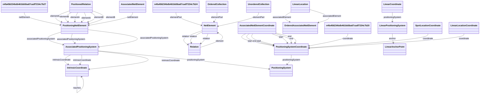

```mermaid
	classDiagram

    
    class PositioningNetElement {
    
    }

    class IntrinsicCoordinate {
    
    }

    class NetElement {
    
    }

    class PositioningSystemCoordinate {
    
    }

    class Relation {
    
    }

    class PositionedRelation {
    
    }

    class AssociatedNetElementCoordinate {
    
    }

    class AssociatedPositioningSystem {
    
    }

    class LinearPositioningSystem {
    
    }

    class LinearLocation {
    
    }


n4fa456234bdb461bb5ba67cadf7234c7b20  --> PositioningSystemCoordinate   :coordinate  

n4fa456234bdb461bb5ba67cadf7234c7b24  --> NetElement   :elementPart  

PositionedRelation  --> PositioningNetElement   :elementA  

PositioningNetElement  --> AssociatedPositioningSystem   :associatedPositioningSystem  

NetElement  --> Relation   :relation  

AssociatedNetElementCoordinate  --> PositioningSystemCoordinate   :start  

Relation  --> NetElement   :element  

LinearLocation  --> OrderedAssociatedNetElement   :associatedElement  

IntrinsicCoordinate  --> IntrinsicCoordinate   :reaches  

AssociatedPositioningSystem  --> IntrinsicCoordinate   :intrinsicCoordinate  

LinearPositioningSystem  --> LinearAnchorPoint   :anchor  

AssociatedNetElementCoordinate  --> PositioningSystemCoordinate   :end  

PositionedRelation  --> PositioningNetElement   :elementB  

n4fa456234bdb461bb5ba67cadf7234c7b27  --> PositioningNetElement   :netElement  

PositionedRelation  --> PositioningNetElement   :elementA  

PositionedRelation  --> PositioningNetElement   :elementA  

AssociatedNetElementCoordinate  --> PositioningSystemCoordinate   :start  

AssociatedNetElementCoordinate  --> PositioningSystemCoordinate   :start  

NetElement  --> Relation   :relation  

NetElement  --> Relation   :relation  

AssociatedNetElement  --> PositioningNetElement   :netElement  

SpotLocationCoordinate  --> PositioningSystemCoordinate   :coordinate  

PositionedRelation  --> PositioningNetElement   :elementB  

AssociatedNetElementCoordinate  --> PositioningSystemCoordinate   :end  

PositionedRelation  --> PositioningNetElement   :elementB  

AssociatedNetElementCoordinate  --> PositioningSystemCoordinate   :end  

PositioningNetElement  --> AssociatedPositioningSystem   :associatedPositioningSystem  

PositioningNetElement  --> AssociatedPositioningSystem   :associatedPositioningSystem  

OrderedCollection  --> NetElement   :elementPart  

PositioningSystemCoordinate  --> PositioningSystem   :positioningSystem  

UnorderedCollection  --> NetElement   :elementPart  

LinearLocationCoordinate  --> PositioningSystemCoordinate   :coordinate  

LinearCoordinate  --> LinearPositioningSystem   :positioningSystem  

AssociatedPositioningSystem  --> IntrinsicCoordinate   :intrinsicCoordinate  

AssociatedPositioningSystem  --> IntrinsicCoordinate   :intrinsicCoordinate  

AssociatedPositioningSystem  --> PositioningSystem   :positioningSystem  

LinearLocation  --> OrderedAssociatedNetElement   :associatedElement  

```