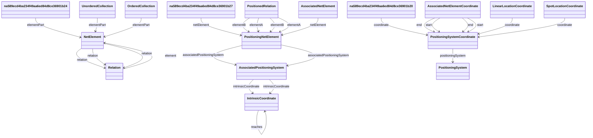

```mermaid
	classDiagram

    
    class PositioningNetElement {
    
    }

    class IntrinsicCoordinate {
    
    }

    class NetElement {
    
    }

    class PositioningSystemCoordinate {
    
    }

    class Relation {
    
    }


PositioningNetElement  --> AssociatedPositioningSystem   :associatedPositioningSystem  

PositionedRelation  --> PositioningNetElement   :elementB  

AssociatedPositioningSystem  --> IntrinsicCoordinate   :intrinsicCoordinate  

AssociatedNetElementCoordinate  --> PositioningSystemCoordinate   :end  

IntrinsicCoordinate  --> IntrinsicCoordinate   :reaches  

na589ecd4ba234f49aa6ed84d8ce36901b20  --> PositioningSystemCoordinate   :coordinate  

AssociatedNetElementCoordinate  --> PositioningSystemCoordinate   :start  

Relation  --> NetElement   :element  

na589ecd4ba234f49aa6ed84d8ce36901b24  --> NetElement   :elementPart  

NetElement  --> Relation   :relation  

na589ecd4ba234f49aa6ed84d8ce36901b27  --> PositioningNetElement   :netElement  

PositionedRelation  --> PositioningNetElement   :elementA  

PositioningNetElement  --> AssociatedPositioningSystem   :associatedPositioningSystem  

NetElement  --> Relation   :relation  

PositionedRelation  --> PositioningNetElement   :elementB  

AssociatedPositioningSystem  --> IntrinsicCoordinate   :intrinsicCoordinate  

AssociatedNetElementCoordinate  --> PositioningSystemCoordinate   :end  

LinearLocationCoordinate  --> PositioningSystemCoordinate   :coordinate  

UnorderedCollection  --> NetElement   :elementPart  

AssociatedNetElementCoordinate  --> PositioningSystemCoordinate   :start  

PositioningSystemCoordinate  --> PositioningSystem   :positioningSystem  

SpotLocationCoordinate  --> PositioningSystemCoordinate   :coordinate  

NetElement  --> Relation   :relation  

PositionedRelation  --> PositioningNetElement   :elementA  

OrderedCollection  --> NetElement   :elementPart  

AssociatedNetElement  --> PositioningNetElement   :netElement  

```