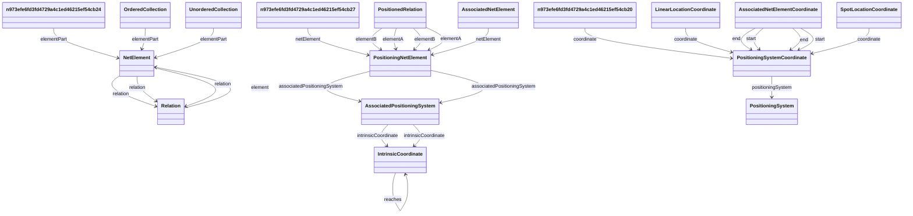

```mermaid
	classDiagram

    
    class PositioningNetElement {
    
    }

    class IntrinsicCoordinate {
    
    }

    class NetElement {
    
    }

    class PositioningSystemCoordinate {
    
    }

    class Relation {
    
    }


PositionedRelation  --> PositioningNetElement   :elementB  

IntrinsicCoordinate  --> IntrinsicCoordinate   :reaches  

PositioningNetElement  --> AssociatedPositioningSystem   :associatedPositioningSystem  

NetElement  --> Relation   :relation  

n973efe6fd3fd4729a4c1ed46215ef54cb24  --> NetElement   :elementPart  

n973efe6fd3fd4729a4c1ed46215ef54cb20  --> PositioningSystemCoordinate   :coordinate  

n973efe6fd3fd4729a4c1ed46215ef54cb27  --> PositioningNetElement   :netElement  

AssociatedNetElementCoordinate  --> PositioningSystemCoordinate   :end  

PositionedRelation  --> PositioningNetElement   :elementA  

Relation  --> NetElement   :element  

AssociatedPositioningSystem  --> IntrinsicCoordinate   :intrinsicCoordinate  

AssociatedNetElementCoordinate  --> PositioningSystemCoordinate   :start  

PositionedRelation  --> PositioningNetElement   :elementB  

LinearLocationCoordinate  --> PositioningSystemCoordinate   :coordinate  

PositioningNetElement  --> AssociatedPositioningSystem   :associatedPositioningSystem  

NetElement  --> Relation   :relation  

SpotLocationCoordinate  --> PositioningSystemCoordinate   :coordinate  

OrderedCollection  --> NetElement   :elementPart  

NetElement  --> Relation   :relation  

UnorderedCollection  --> NetElement   :elementPart  

PositionedRelation  --> PositioningNetElement   :elementA  

AssociatedNetElementCoordinate  --> PositioningSystemCoordinate   :end  

AssociatedNetElement  --> PositioningNetElement   :netElement  

AssociatedPositioningSystem  --> IntrinsicCoordinate   :intrinsicCoordinate  

PositioningSystemCoordinate  --> PositioningSystem   :positioningSystem  

AssociatedNetElementCoordinate  --> PositioningSystemCoordinate   :start  

```