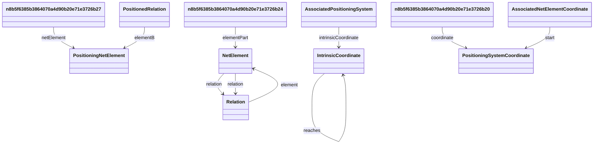

```mermaid
	classDiagram

    
    class PositioningNetElement {
    
    }

    class IntrinsicCoordinate {
    
    }

    class NetElement {
    
    }

    class PositioningSystemCoordinate {
    
    }

    class Relation {
    
    }


Relation  --> NetElement   :element  

IntrinsicCoordinate  --> IntrinsicCoordinate   :reaches  

NetElement  --> Relation   :relation  

n8b5f6385b3864070a4d90b20e71e3726b27  --> PositioningNetElement   :netElement  

AssociatedPositioningSystem  --> IntrinsicCoordinate   :intrinsicCoordinate  

n8b5f6385b3864070a4d90b20e71e3726b24  --> NetElement   :elementPart  

n8b5f6385b3864070a4d90b20e71e3726b20  --> PositioningSystemCoordinate   :coordinate  

AssociatedNetElementCoordinate  --> PositioningSystemCoordinate   :start  

PositionedRelation  --> PositioningNetElement   :elementB  

NetElement  --> Relation   :relation  

```