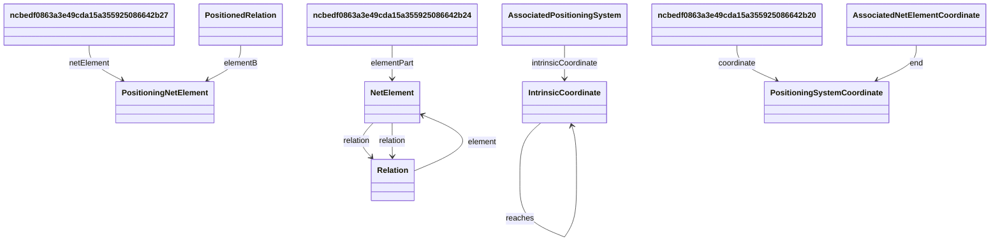

```mermaid
	classDiagram

    
    class PositioningNetElement {
    
    }

    class IntrinsicCoordinate {
    
    }

    class NetElement {
    
    }

    class PositioningSystemCoordinate {
    
    }

    class Relation {
    
    }


NetElement  --> Relation   :relation  

ncbedf0863a3e49cda15a355925086642b24  --> NetElement   :elementPart  

ncbedf0863a3e49cda15a355925086642b27  --> PositioningNetElement   :netElement  

PositionedRelation  --> PositioningNetElement   :elementB  

AssociatedPositioningSystem  --> IntrinsicCoordinate   :intrinsicCoordinate  

ncbedf0863a3e49cda15a355925086642b20  --> PositioningSystemCoordinate   :coordinate  

IntrinsicCoordinate  --> IntrinsicCoordinate   :reaches  

Relation  --> NetElement   :element  

AssociatedNetElementCoordinate  --> PositioningSystemCoordinate   :end  

NetElement  --> Relation   :relation  

```