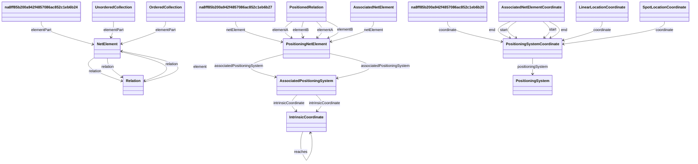

```mermaid
	classDiagram

    
    class PositioningNetElement {
    
    }

    class IntrinsicCoordinate {
    
    }

    class NetElement {
    
    }

    class PositioningSystemCoordinate {
    
    }

    class Relation {
    
    }


AssociatedNetElementCoordinate  --> PositioningSystemCoordinate   :end  

NetElement  --> Relation   :relation  

AssociatedNetElementCoordinate  --> PositioningSystemCoordinate   :start  

PositioningNetElement  --> AssociatedPositioningSystem   :associatedPositioningSystem  

na8ff85b200a942f4857086ac852c1eb6b27  --> PositioningNetElement   :netElement  

na8ff85b200a942f4857086ac852c1eb6b20  --> PositioningSystemCoordinate   :coordinate  

AssociatedPositioningSystem  --> IntrinsicCoordinate   :intrinsicCoordinate  

PositionedRelation  --> PositioningNetElement   :elementA  

na8ff85b200a942f4857086ac852c1eb6b24  --> NetElement   :elementPart  

PositionedRelation  --> PositioningNetElement   :elementB  

Relation  --> NetElement   :element  

IntrinsicCoordinate  --> IntrinsicCoordinate   :reaches  

PositionedRelation  --> PositioningNetElement   :elementA  

PositioningNetElement  --> AssociatedPositioningSystem   :associatedPositioningSystem  

AssociatedNetElementCoordinate  --> PositioningSystemCoordinate   :start  

LinearLocationCoordinate  --> PositioningSystemCoordinate   :coordinate  

PositionedRelation  --> PositioningNetElement   :elementB  

SpotLocationCoordinate  --> PositioningSystemCoordinate   :coordinate  

UnorderedCollection  --> NetElement   :elementPart  

AssociatedPositioningSystem  --> IntrinsicCoordinate   :intrinsicCoordinate  

NetElement  --> Relation   :relation  

PositioningSystemCoordinate  --> PositioningSystem   :positioningSystem  

AssociatedNetElementCoordinate  --> PositioningSystemCoordinate   :end  

NetElement  --> Relation   :relation  

OrderedCollection  --> NetElement   :elementPart  

AssociatedNetElement  --> PositioningNetElement   :netElement  

```