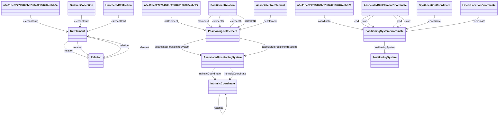

```mermaid
	classDiagram

    
    class PositioningNetElement {
    
    }

    class IntrinsicCoordinate {
    
    }

    class NetElement {
    
    }

    class PositioningSystemCoordinate {
    
    }

    class Relation {
    
    }


AssociatedNetElementCoordinate  --> PositioningSystemCoordinate   :end  

PositioningNetElement  --> AssociatedPositioningSystem   :associatedPositioningSystem  

NetElement  --> Relation   :relation  

n8e11bc827729408bb2d8402190787eabb24  --> NetElement   :elementPart  

AssociatedNetElementCoordinate  --> PositioningSystemCoordinate   :start  

PositionedRelation  --> PositioningNetElement   :elementA  

Relation  --> NetElement   :element  

n8e11bc827729408bb2d8402190787eabb27  --> PositioningNetElement   :netElement  

n8e11bc827729408bb2d8402190787eabb20  --> PositioningSystemCoordinate   :coordinate  

PositionedRelation  --> PositioningNetElement   :elementB  

AssociatedPositioningSystem  --> IntrinsicCoordinate   :intrinsicCoordinate  

IntrinsicCoordinate  --> IntrinsicCoordinate   :reaches  

SpotLocationCoordinate  --> PositioningSystemCoordinate   :coordinate  

PositionedRelation  --> PositioningNetElement   :elementA  

AssociatedNetElementCoordinate  --> PositioningSystemCoordinate   :end  

AssociatedNetElement  --> PositioningNetElement   :netElement  

AssociatedPositioningSystem  --> IntrinsicCoordinate   :intrinsicCoordinate  

NetElement  --> Relation   :relation  

NetElement  --> Relation   :relation  

LinearLocationCoordinate  --> PositioningSystemCoordinate   :coordinate  

AssociatedNetElementCoordinate  --> PositioningSystemCoordinate   :start  

OrderedCollection  --> NetElement   :elementPart  

UnorderedCollection  --> NetElement   :elementPart  

PositioningSystemCoordinate  --> PositioningSystem   :positioningSystem  

PositioningNetElement  --> AssociatedPositioningSystem   :associatedPositioningSystem  

PositionedRelation  --> PositioningNetElement   :elementB  

```