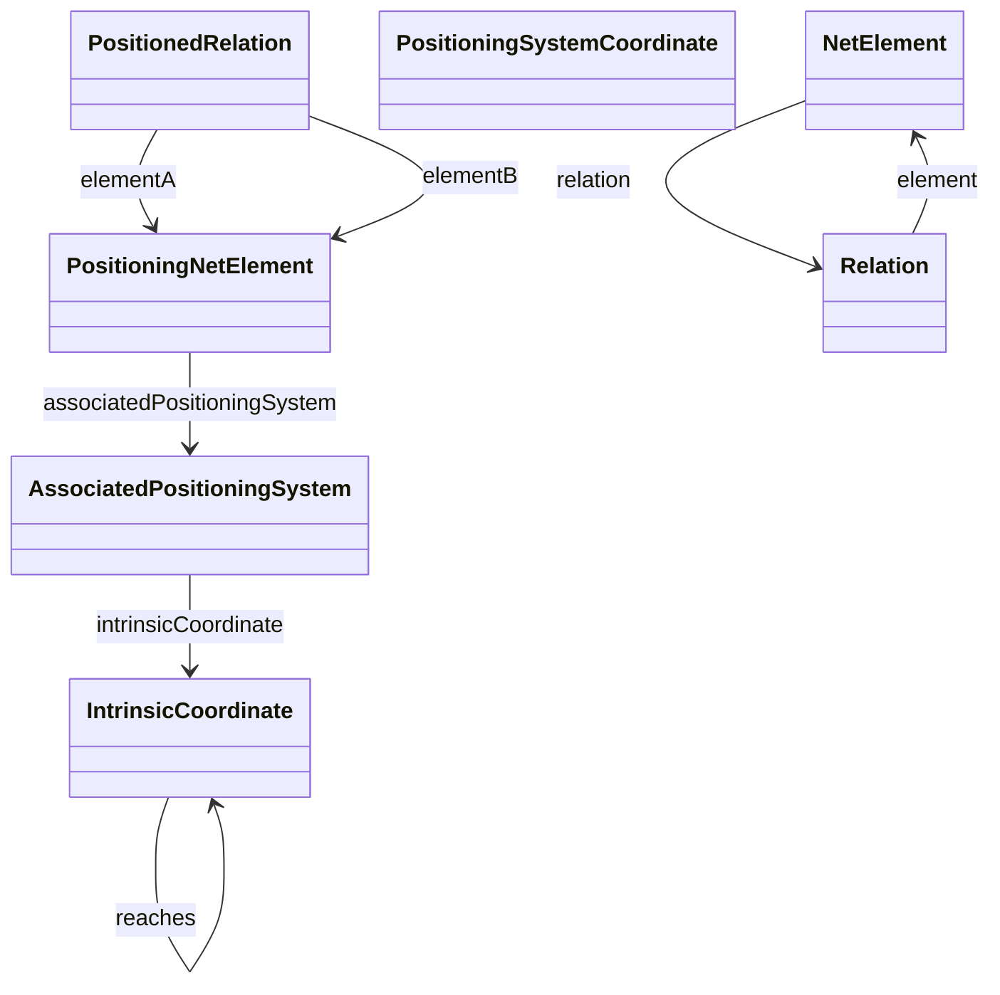

```mermaid
	classDiagram

    
    class `PositioningNetElement` {
    
    }

    class `IntrinsicCoordinate` {
    
    }

    class `NetElement` {
    
    }

    class `PositioningSystemCoordinate` {
    
    }

    class `AssociatedPositioningSystem` {
    
    }

    class `Relation` {
    
    }

    class `PositionedRelation` {
    
    }


`NetElement`  --> `Relation`   :relation  

`Relation`  --> `NetElement`   :element  

`PositioningNetElement`  --> `AssociatedPositioningSystem`   :associatedPositioningSystem  

`PositionedRelation`  --> `PositioningNetElement`   :elementA  

`AssociatedPositioningSystem`  --> `IntrinsicCoordinate`   :intrinsicCoordinate  

`PositionedRelation`  --> `PositioningNetElement`   :elementB  

`IntrinsicCoordinate`  --> `IntrinsicCoordinate`   :reaches  

```