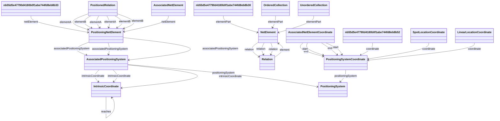

```mermaid
	classDiagram

    
    class PositioningNetElement {
    
    }

    class IntrinsicCoordinate {
    
    }

    class NetElement {
    
    }

    class PositioningSystemCoordinate {
    
    }

    class AssociatedPositioningSystem {
    
    }

    class Relation {
    
    }

    class PositionedRelation {
    
    }


AssociatedPositioningSystem  --> IntrinsicCoordinate   :intrinsicCoordinate  

Relation  --> NetElement   :element  

nb55d5e47790d4180b0f1abe744fd8eb8b33  --> PositioningNetElement   :netElement  

PositionedRelation  --> PositioningNetElement   :elementA  

NetElement  --> Relation   :relation  

IntrinsicCoordinate  --> IntrinsicCoordinate   :reaches  

AssociatedNetElementCoordinate  --> PositioningSystemCoordinate   :end  

AssociatedNetElementCoordinate  --> PositioningSystemCoordinate   :start  

nb55d5e47790d4180b0f1abe744fd8eb8b52  --> PositioningSystemCoordinate   :coordinate  

nb55d5e47790d4180b0f1abe744fd8eb8b30  --> NetElement   :elementPart  

PositionedRelation  --> PositioningNetElement   :elementB  

PositioningNetElement  --> AssociatedPositioningSystem   :associatedPositioningSystem  

AssociatedPositioningSystem  --> IntrinsicCoordinate   :intrinsicCoordinate  

AssociatedPositioningSystem  --> IntrinsicCoordinate   :intrinsicCoordinate  

AssociatedPositioningSystem  --> PositioningSystem   :positioningSystem  

OrderedCollection  --> NetElement   :elementPart  

NetElement  --> Relation   :relation  

NetElement  --> Relation   :relation  

AssociatedNetElementCoordinate  --> PositioningSystemCoordinate   :end  

AssociatedNetElementCoordinate  --> PositioningSystemCoordinate   :start  

UnorderedCollection  --> NetElement   :elementPart  

PositioningNetElement  --> AssociatedPositioningSystem   :associatedPositioningSystem  

PositionedRelation  --> PositioningNetElement   :elementA  

PositionedRelation  --> PositioningNetElement   :elementA  

SpotLocationCoordinate  --> PositioningSystemCoordinate   :coordinate  

PositionedRelation  --> PositioningNetElement   :elementB  

PositionedRelation  --> PositioningNetElement   :elementB  

LinearLocationCoordinate  --> PositioningSystemCoordinate   :coordinate  

PositioningSystemCoordinate  --> PositioningSystem   :positioningSystem  

AssociatedNetElement  --> PositioningNetElement   :netElement  

PositioningNetElement  --> AssociatedPositioningSystem   :associatedPositioningSystem  

```