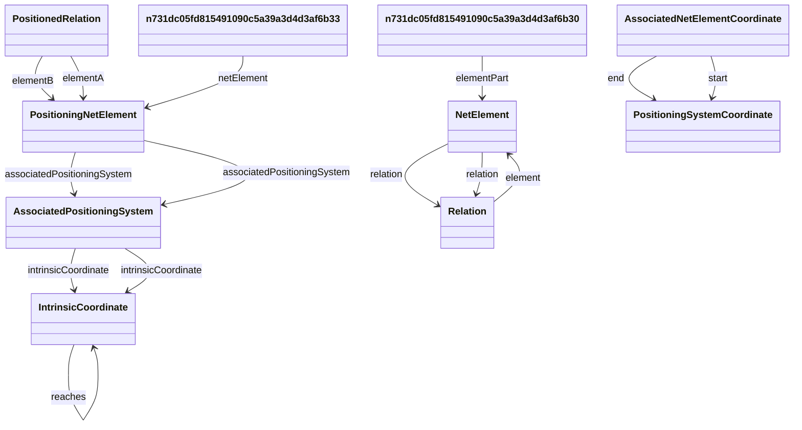

```mermaid
	classDiagram

    
    class PositioningNetElement {
    
    }

    class IntrinsicCoordinate {
    
    }

    class NetElement {
    
    }

    class PositioningSystemCoordinate {
    
    }

    class AssociatedPositioningSystem {
    
    }

    class Relation {
    
    }

    class PositionedRelation {
    
    }


IntrinsicCoordinate  --> IntrinsicCoordinate   :reaches  

AssociatedPositioningSystem  --> IntrinsicCoordinate   :intrinsicCoordinate  

NetElement  --> Relation   :relation  

PositionedRelation  --> PositioningNetElement   :elementB  

PositionedRelation  --> PositioningNetElement   :elementA  

PositioningNetElement  --> AssociatedPositioningSystem   :associatedPositioningSystem  

Relation  --> NetElement   :element  

AssociatedNetElementCoordinate  --> PositioningSystemCoordinate   :end  

n731dc05fd815491090c5a39a3d4d3af6b30  --> NetElement   :elementPart  

AssociatedNetElementCoordinate  --> PositioningSystemCoordinate   :start  

n731dc05fd815491090c5a39a3d4d3af6b33  --> PositioningNetElement   :netElement  

PositioningNetElement  --> AssociatedPositioningSystem   :associatedPositioningSystem  

AssociatedPositioningSystem  --> IntrinsicCoordinate   :intrinsicCoordinate  

NetElement  --> Relation   :relation  

```