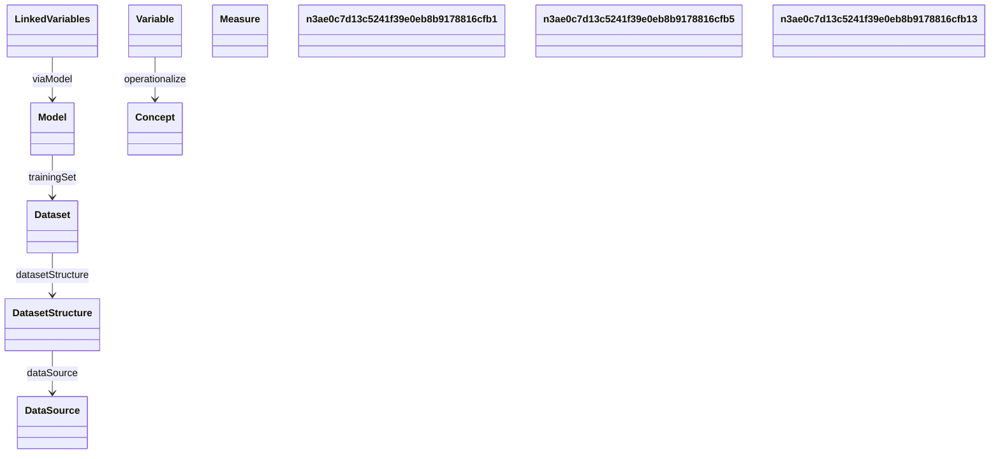

```mermaid
	classDiagram

    
    class Variable {
    
    }

    class Model {
    
    }

    class LinkedVariables {
    
    }

    class DatasetStructure {
    
    }

    class Dataset {
    
    }

    class Measure {
    
    }

    class n3ae0c7d13c5241f39e0eb8b9178816cfb1 {
    
    }

    class n3ae0c7d13c5241f39e0eb8b9178816cfb5 {
    
    }

    class n3ae0c7d13c5241f39e0eb8b9178816cfb13 {
    
    }

    class DataSource {
    
    }


Model  --> Dataset   :trainingSet  

DatasetStructure  --> DataSource   :dataSource  

LinkedVariables  --> Model   :viaModel  

Dataset  --> DatasetStructure   :datasetStructure  

Variable  --> Concept   :operationalize  

```