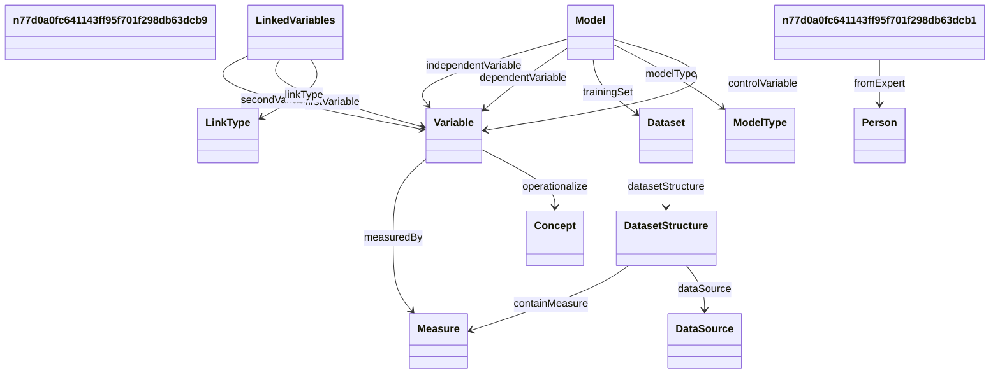

```mermaid
	classDiagram

    
    class Variable {
    
    }

    class Measure {
    
    }

    class DataSource {
    
    }

    class DatasetStructure {
    
    }

    class Person {
    
    }

    class LinkType {
    
    }

    class ModelType {
    
    }

    class Concept {
    
    }

    class n77d0a0fc641143ff95f701f298db63dcb9 {
    
    }

    class Dataset {
    
    }


Dataset  --> DatasetStructure   :datasetStructure  

Model  --> Variable   :independentVariable  

n77d0a0fc641143ff95f701f298db63dcb1  --> Person   :fromExpert  

LinkedVariables  --> Variable   :secondVariable  

Variable  --> Measure   :measuredBy  

LinkedVariables  --> Variable   :firstVariable  

Model  --> Variable   :dependentVariable  

LinkedVariables  --> LinkType   :linkType  

Model  --> Dataset   :trainingSet  

Variable  --> Concept   :operationalize  

Model  --> ModelType   :modelType  

DatasetStructure  --> Measure   :containMeasure  

Model  --> Variable   :controlVariable  

DatasetStructure  --> DataSource   :dataSource  

```