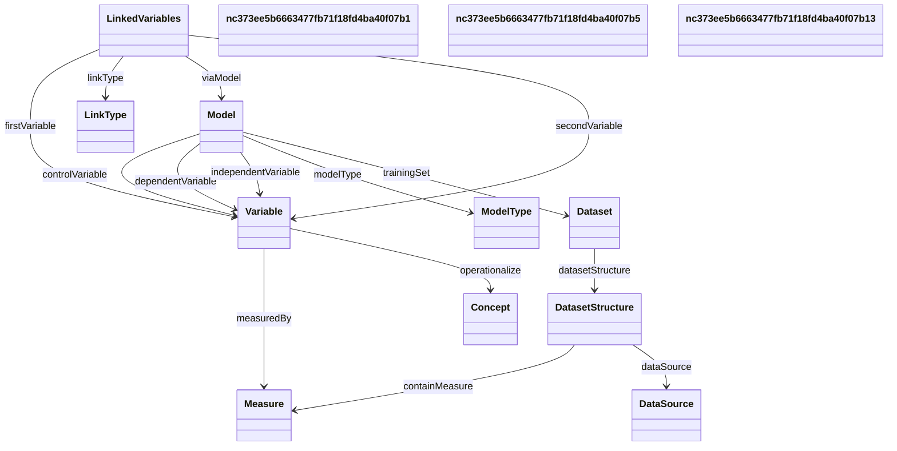

```mermaid
	classDiagram

    
    class Variable {
    
    }

    class Model {
    
    }

    class LinkedVariables {
    
    }

    class DatasetStructure {
    
    }

    class Dataset {
    
    }

    class Measure {
    
    }

    class nc373ee5b6663477fb71f18fd4ba40f07b1 {
    
    }

    class nc373ee5b6663477fb71f18fd4ba40f07b5 {
    
    }

    class nc373ee5b6663477fb71f18fd4ba40f07b13 {
    
    }

    class DataSource {
    
    }


Variable  --> Measure   :measuredBy  

Model  --> Variable   :controlVariable  

LinkedVariables  --> Variable   :firstVariable  

DatasetStructure  --> Measure   :containMeasure  

LinkedVariables  --> LinkType   :linkType  

Model  --> Variable   :dependentVariable  

Model  --> Variable   :independentVariable  

LinkedVariables  --> Model   :viaModel  

Dataset  --> DatasetStructure   :datasetStructure  

Model  --> ModelType   :modelType  

LinkedVariables  --> Variable   :secondVariable  

Variable  --> Concept   :operationalize  

DatasetStructure  --> DataSource   :dataSource  

Model  --> Dataset   :trainingSet  

```