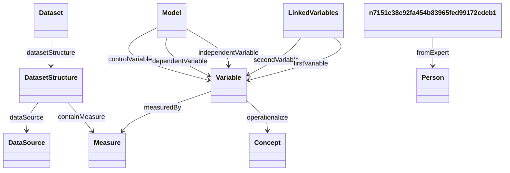

```mermaid
	classDiagram

    
    class Variable {
    
    }

    class Measure {
    
    }

    class DataSource {
    
    }

    class DatasetStructure {
    
    }

    class Person {
    
    }


DatasetStructure  --> DataSource   :dataSource  

Variable  --> Measure   :measuredBy  

Dataset  --> DatasetStructure   :datasetStructure  

n7151c38c92fa454b83965fed99172cdcb1  --> Person   :fromExpert  

Model  --> Variable   :controlVariable  

Model  --> Variable   :dependentVariable  

LinkedVariables  --> Variable   :secondVariable  

DatasetStructure  --> Measure   :containMeasure  

Variable  --> Concept   :operationalize  

Model  --> Variable   :independentVariable  

LinkedVariables  --> Variable   :firstVariable  

```