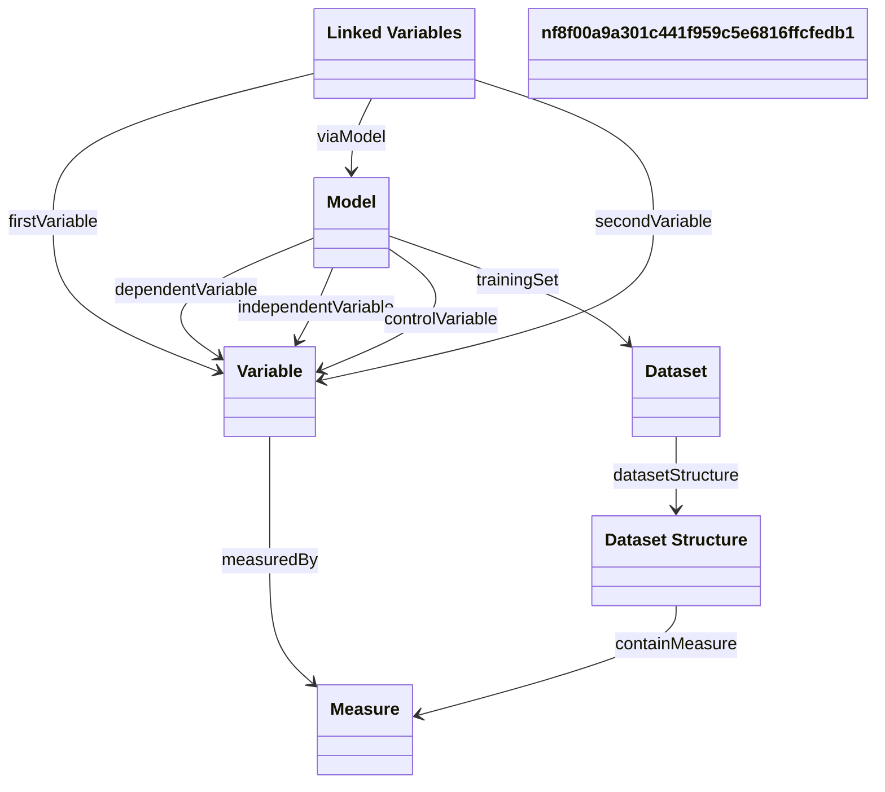

```mermaid
	classDiagram

    
    class `Variable` {
    
    }

    class `Model` {
    
    }

    class `Linked Variables` {
    
    }

    class `Dataset Structure` {
    
    }

    class `Dataset` {
    
    }

    class `Measure` {
    
    }

    class `nf8f00a9a301c441f959c5e6816ffcfedb1` {
    
    }


`Variable`  --> `Measure`   :measuredBy  

`Model`  --> `Variable`   :dependentVariable  

`Linked Variables`  --> `Variable`   :firstVariable  

`Linked Variables`  --> `Model`   :viaModel  

`Dataset Structure`  --> `Measure`   :containMeasure  

`Model`  --> `Variable`   :independentVariable  

`Linked Variables`  --> `Variable`   :secondVariable  

`Model`  --> `Variable`   :controlVariable  

`Model`  --> `Dataset`   :trainingSet  

`Dataset`  --> `Dataset Structure`   :datasetStructure  

```