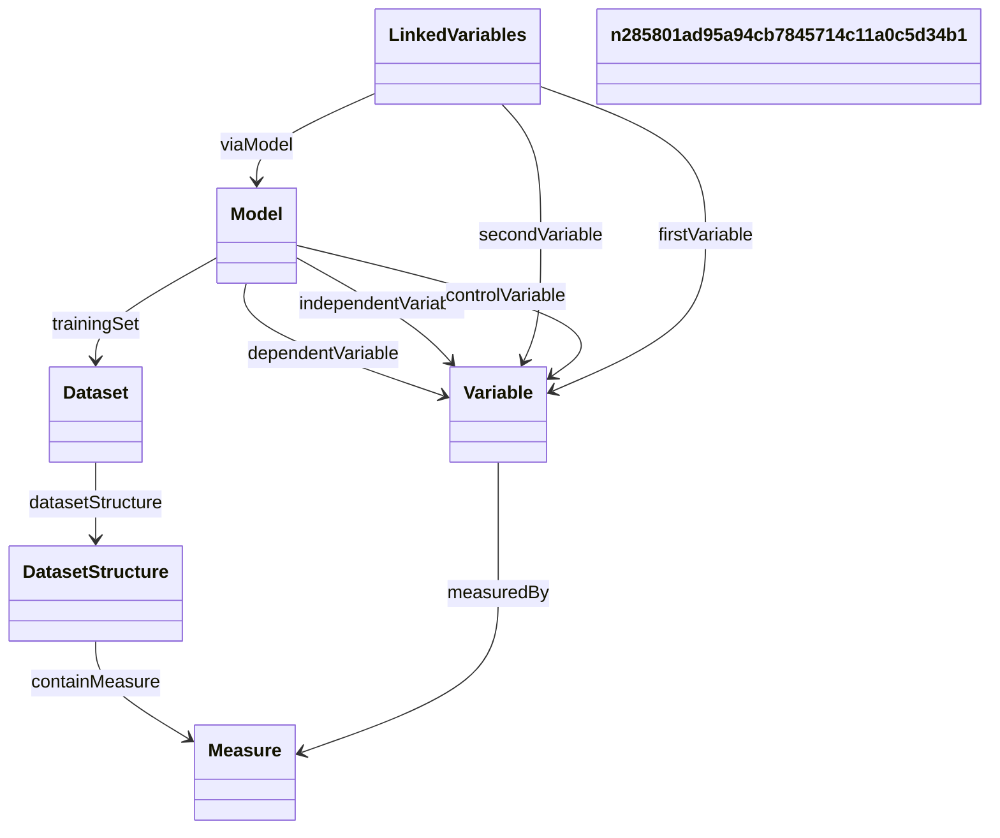

```mermaid
	classDiagram

    
    class `Variable` {
    
    }

    class `Model` {
    
    }

    class `LinkedVariables` {
    
    }

    class `DatasetStructure` {
    
    }

    class `Dataset` {
    
    }

    class `Measure` {
    
    }

    class `n285801ad95a94cb7845714c11a0c5d34b1` {
    
    }


`Model`  --> `Variable`   :dependentVariable  

`Model`  --> `Variable`   :independentVariable  

`LinkedVariables`  --> `Variable`   :secondVariable  

`DatasetStructure`  --> `Measure`   :containMeasure  

`Model`  --> `Variable`   :controlVariable  

`Model`  --> `Dataset`   :trainingSet  

`Dataset`  --> `DatasetStructure`   :datasetStructure  

`LinkedVariables`  --> `Model`   :viaModel  

`Variable`  --> `Measure`   :measuredBy  

`LinkedVariables`  --> `Variable`   :firstVariable  

```