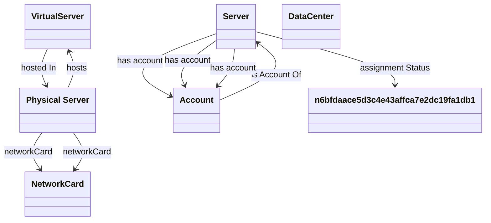

```mermaid
	classDiagram

    
    class `VirtualServer` {
    
    }

    class `Physical Server` {
    
    }

    class `Server` {
    
    }

    class `Account` {
    
    }

    class `DataCenter` {
    
    }

    class `NetworkCard` {
    
    }

    class `n6bfdaace5d3c4e43affca7e2dc19fa1db1` {
    
    }


`VirtualServer`  --> `Physical Server`   :hosted In  

`Server`  --> `n6bfdaace5d3c4e43affca7e2dc19fa1db1`   :assignment Status  

`Physical Server`  --> `VirtualServer`   :hosts  

`Account`  --> `Server`   :is Account Of  

`Server`  --> `Account`   :has account  

`Physical Server`  --> `NetworkCard`   :networkCard  

`Physical Server`  --> `NetworkCard`   :networkCard  

`Server`  --> `Account`   :has account  

`Server`  --> `Account`   :has account  

```