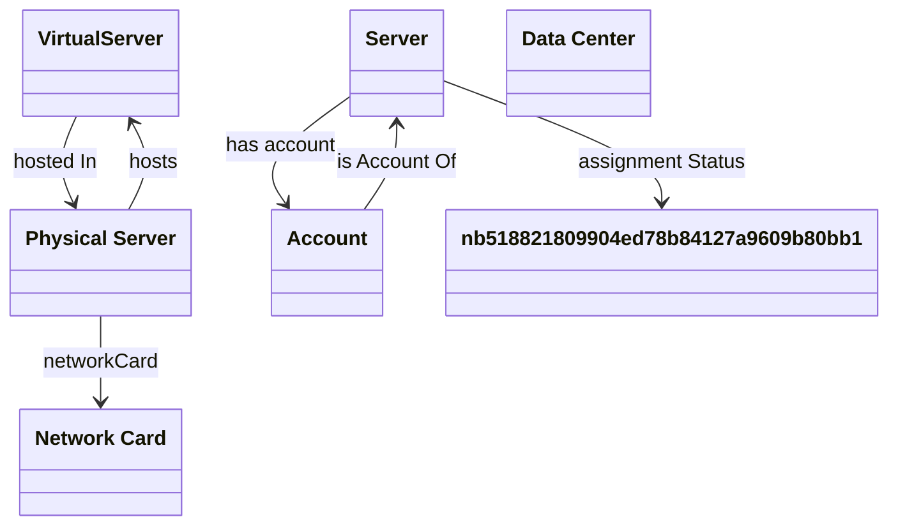

```mermaid
	classDiagram

    
    class `VirtualServer` {
    
    }

    class `Physical Server` {
    
    }

    class `Server` {
    
    }

    class `Account` {
    
    }

    class `Data Center` {
    
    }

    class `Network Card` {
    
    }

    class `nb518821809904ed78b84127a9609b80bb1` {
    
    }


`Account`  --> `Server`   :is Account Of  

`Physical Server`  --> `VirtualServer`   :hosts  

`Physical Server`  --> `Network Card`   :networkCard  

`Server`  --> `nb518821809904ed78b84127a9609b80bb1`   :assignment Status  

`Server`  --> `Account`   :has account  

`VirtualServer`  --> `Physical Server`   :hosted In  

```