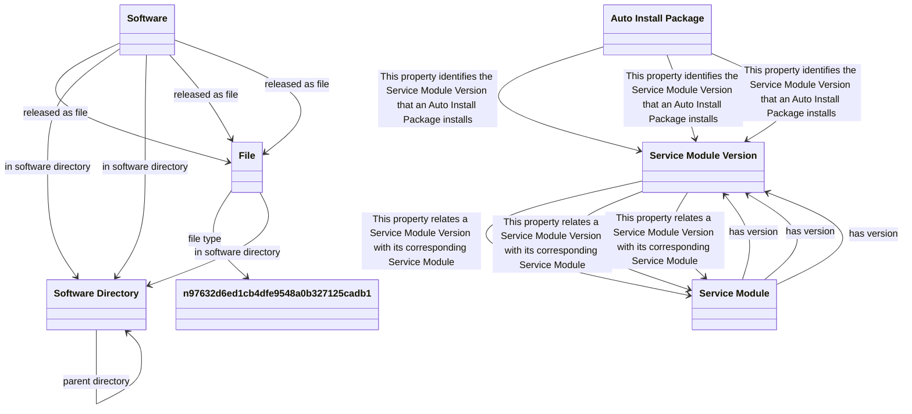

```mermaid
	classDiagram

    
    class `File` {
    
    }

    class `Software` {
    
    }

    class `Software Directory` {
    
    }

    class `Service Module Version` {
    
    }

    class `Service Module` {
    
    }

    class `Auto Install Package` {
    
    }

    class `n97632d6ed1cb4dfe9548a0b327125cadb1` {
    
    }


`Software`  --> `File`   :released as file  

`Software Directory`  --> `Software Directory`   :parent directory  

`Auto Install Package`  --> `Service Module Version`   :This property identifies the Service Module Version that an Auto Install Package installs  

`File`  --> `n97632d6ed1cb4dfe9548a0b327125cadb1`   :file type  

`File`  --> `Software Directory`   :in software directory  

`Service Module Version`  --> `Service Module`   :This property relates a Service Module Version with its corresponding Service Module  

`Service Module`  --> `Service Module Version`   :has version  

`Software`  --> `Software Directory`   :in software directory  

`Software`  --> `Software Directory`   :in software directory  

`Service Module`  --> `Service Module Version`   :has version  

`Software`  --> `File`   :released as file  

`Software`  --> `File`   :released as file  

`Software Directory`  --> `Software Directory`   :parent directory  

`Software Directory`  --> `Software Directory`   :parent directory  

`Auto Install Package`  --> `Service Module Version`   :This property identifies the Service Module Version that an Auto Install Package installs  

`Service Module Version`  --> `Service Module`   :This property relates a Service Module Version with its corresponding Service Module  

`Auto Install Package`  --> `Service Module Version`   :This property identifies the Service Module Version that an Auto Install Package installs  

`Service Module Version`  --> `Service Module`   :This property relates a Service Module Version with its corresponding Service Module  

`Service Module`  --> `Service Module Version`   :has version  

```