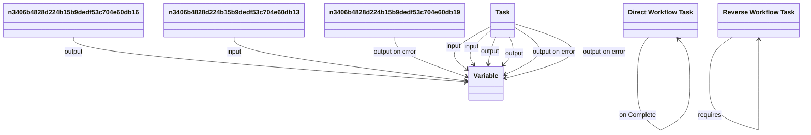

```mermaid
	classDiagram

    
    class `Direct Workflow Task` {
    
    }

    class `Variable` {
    
    }

    class `Reverse Workflow Task` {
    
    }

    class `Task` {
    
    }

    class `n3406b4828d224b15b9dedf53c704e60db13` {
    
    }

    class `n3406b4828d224b15b9dedf53c704e60db16` {
    
    }

    class `n3406b4828d224b15b9dedf53c704e60db19` {
    
    }


`n3406b4828d224b15b9dedf53c704e60db16`  --> `Variable`   :output  

`n3406b4828d224b15b9dedf53c704e60db13`  --> `Variable`   :input  

`Direct Workflow Task`  --> `Direct Workflow Task`   :on Success  

`n3406b4828d224b15b9dedf53c704e60db19`  --> `Variable`   :output on error  

`Reverse Workflow Task`  --> `Reverse Workflow Task`   :requires  

`Direct Workflow Task`  --> `Direct Workflow Task`   :on Error  

`Direct Workflow Task`  --> `Direct Workflow Task`   :on Complete  

`Direct Workflow Task`  --> `Direct Workflow Task`   :on Error  

`Task`  --> `Variable`   :input  

`Task`  --> `Variable`   :input  

`Direct Workflow Task`  --> `Direct Workflow Task`   :on Complete  

`Task`  --> `Variable`   :output  

`Task`  --> `Variable`   :output  

`Task`  --> `Variable`   :output on error  

`Direct Workflow Task`  --> `Direct Workflow Task`   :on Success  

`Direct Workflow Task`  --> `Direct Workflow Task`   :on Success  

`Task`  --> `Variable`   :output on error  

`Reverse Workflow Task`  --> `Reverse Workflow Task`   :requires  

`Direct Workflow Task`  --> `Direct Workflow Task`   :on Error  

`Reverse Workflow Task`  --> `Reverse Workflow Task`   :requires  

`Direct Workflow Task`  --> `Direct Workflow Task`   :on Complete  

```