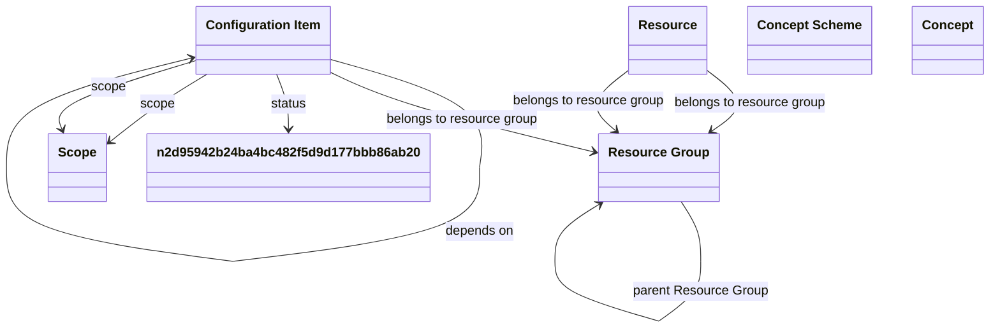

```mermaid
	classDiagram

    
    class `Resource Group` {
    
    }

    class `Resource` {
    
    }

    class `Configuration Item` {
    
    }

    class `Concept Scheme` {
    
    }

    class `Scope` {
    
    }

    class `Concept` {
    
    }

    class `n2d95942b24ba4bc482f5d9d177bbb86ab20` {
    
    }


`Resource Group`  --> `Resource Group`   :parent Resource Group  

`Configuration Item`  --> `Configuration Item`   :depends on  

`Configuration Item`  --> `Resource Group`   :belongs to resource group  

`Resource Group`  --> `Resource Group`   :parent Resource Group  

`Resource Group`  --> `Resource Group`   :parent Resource Group  

`Configuration Item`  --> `n2d95942b24ba4bc482f5d9d177bbb86ab20`   :status  

`Configuration Item`  --> `Scope`   :scope  

`Configuration Item`  --> `Configuration Item`   :depends on  

`Configuration Item`  --> `Configuration Item`   :depends on  

`Resource`  --> `Resource Group`   :belongs to resource group  

`Resource`  --> `Resource Group`   :belongs to resource group  

`Configuration Item`  --> `Scope`   :scope  

```