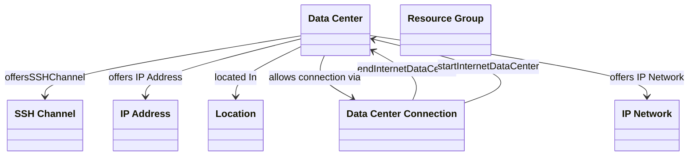

```mermaid
	classDiagram

    
    class `Data Center` {
    
    }

    class `Data Center Connection` {
    
    }

    class `Location` {
    
    }

    class `SSH Channel` {
    
    }

    class `Resource Group` {
    
    }

    class `IP Address` {
    
    }

    class `IP Network` {
    
    }


`Data Center Connection`  --> `Data Center`   :endInternetDataCenter  

`Data Center`  --> `SSH Channel`   :offersSSHChannel  

`Data Center`  --> `IP Address`   :offers IP Address  

`Data Center`  --> `Location`   :located In  

`Data Center`  --> `Data Center Connection`   :allows connection via  

`Data Center`  --> `IP Network`   :offers IP Network  

`Data Center Connection`  --> `Data Center`   :startInternetDataCenter  

```