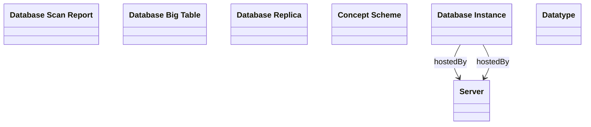

```mermaid
	classDiagram

    
    class `Database Scan Report` {
    
    }

    class `Database Big Table` {
    
    }

    class `Database Replica` {
    
    }

    class `Concept Scheme` {
    
    }

    class `Database Instance` {
    
    }

    class `Server` {
    
    }

    class `Datatype` {
    
    }


`Database Instance`  --> `Server`   :hostedBy  

`Database Instance`  --> `Server`   :hostedBy  

```