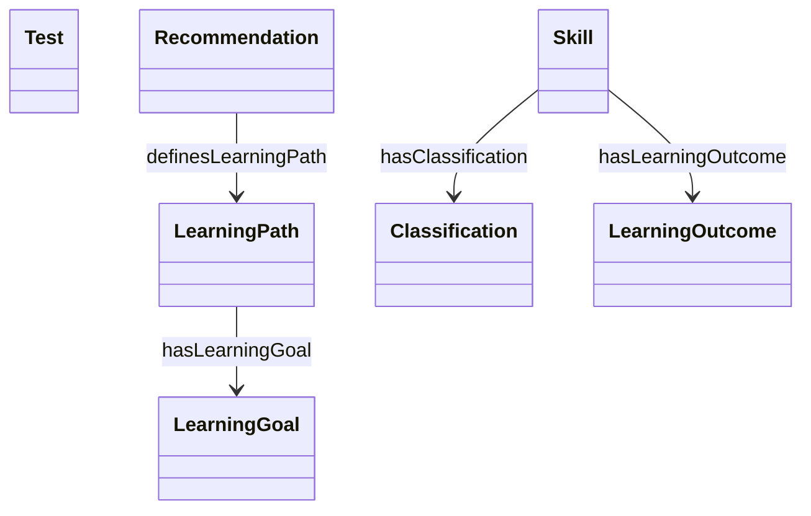

```mermaid
	classDiagram

    
    class `LearningPath` {
    
    }

    class `Test` {
    
    }

    class `Skill` {
    
    }

    class `LearningGoal` {
    
    }

    class `Classification` {
    
    }

    class `LearningOutcome` {
    
    }

    class `Recommendation` {
    
    }


`LearningPath`  --> `LearningGoal`   :hasLearningGoal  

`Recommendation`  --> `LearningPath`   :definesLearningPath  

`Skill`  --> `LearningOutcome`   :hasLearningOutcome  

`Skill`  --> `Classification`   :hasClassification  

```