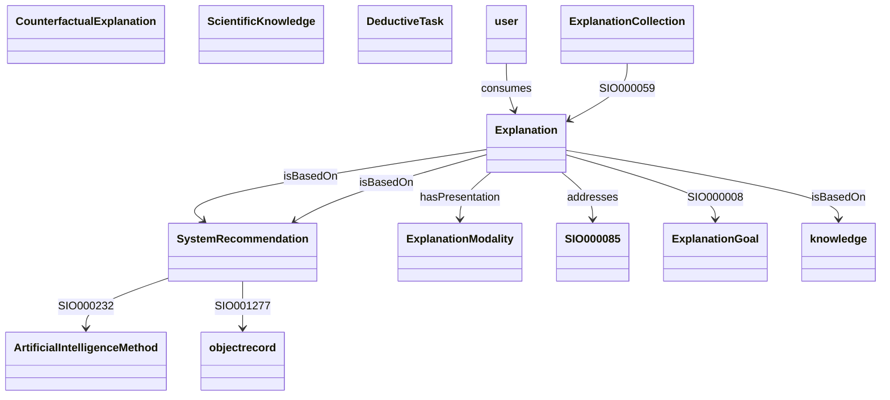

```mermaid
	classDiagram

    
    class Explanation {
    
    }

    class SystemRecommendation {
    
    }

    class CounterfactualExplanation {
    
    }

    class ScientificKnowledge {
    
    }

    class DeductiveTask {
    
    }


Explanation  --> ExplanationModality   :hasPresentation  

user  --> Explanation   :consumes  

SystemRecommendation  --> ArtificialIntelligenceMethod   :SIO000232  

Explanation  --> SIO000085   :addresses  

Explanation  --> ExplanationGoal   :SIO000008  

Explanation  --> knowledge   :isBasedOn  

SystemRecommendation  --> objectrecord   :SIO001277  

Explanation  --> SystemRecommendation   :isBasedOn  

ExplanationCollection  --> Explanation   :SIO000059  

Explanation  --> SystemRecommendation   :isBasedOn  

```