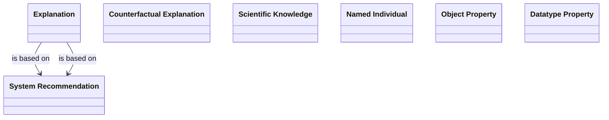

```mermaid
	classDiagram

    
    class `Explanation` {
    
    }

    class `System Recommendation` {
    
    }

    class `Counterfactual Explanation` {
    
    }

    class `Scientific Knowledge` {
    
    }

    class `Named Individual` {
    
    }

    class `Object Property` {
    
    }

    class `Datatype Property` {
    
    }


`Explanation`  --> `System Recommendation`   :is based on  

`Explanation`  --> `System Recommendation`   :is based on  

```