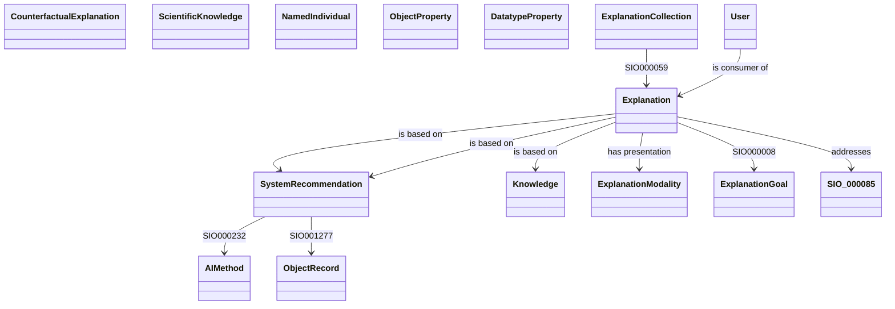

```mermaid
	classDiagram

    
    class Explanation {
    
    }

    class System Recommendation {
    
    }

    class Counterfactual Explanation {
    
    }

    class Scientific Knowledge {
    
    }

    class Named Individual {
    
    }

    class Object Property {
    
    }

    class Datatype Property {
    
    }


Explanation  --> Knowledge   :is based on  

Explanation  --> Explanation Modality   :has presentation  

ExplanationCollection  --> Explanation   :SIO000059  

Explanation  --> Explanation Goal   :SIO000008  

User  --> Explanation   :is consumer of  

Explanation  --> System Recommendation   :is based on  

System Recommendation  --> AI Method   :SIO000232  

System Recommendation  --> Object Record   :SIO001277  

Explanation  --> System Recommendation   :is based on  

Explanation  --> SIO_000085   :addresses  

```