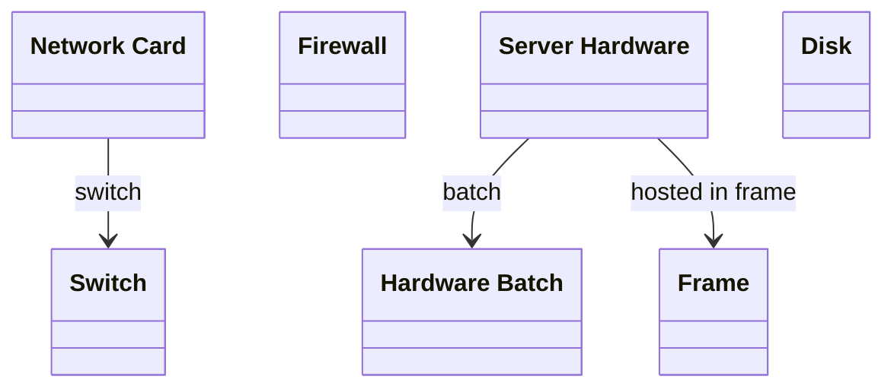

```mermaid
	classDiagram

    
    class `Network Card` {
    
    }

    class `Firewall` {
    
    }

    class `Frame` {
    
    }

    class `Switch` {
    
    }

    class `Hardware Batch` {
    
    }

    class `Server Hardware` {
    
    }

    class `Disk` {
    
    }


`Server Hardware`  --> `Hardware Batch`   :batch  

`Network Card`  --> `Switch`   :switch  

`Server Hardware`  --> `Frame`   :hosted in frame  

```