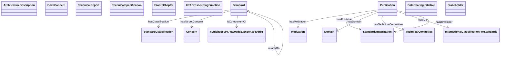

```mermaid
	classDiagram

    
    class ArchitectureDescription {
    
    }

    class BdvaConcern {
    
    }

    class TechnicalReport {
    
    }

    class TechnicalSpecification {
    
    }

    class FiwareChapter {
    
    }

    class IIRACrosscuttingFunction {
    
    }

    class Standard {
    
    }

    class Publication {
    
    }

    class DataSharingInitiative {
    
    }

    class Stakeholder {
    
    }


Standard  --> StandardClassification   :hasClassification  

Standard  --> Concern   :hasTargetConcern  

Publication  --> Motivation   :hasMotivation  

Standard  --> n0fdeba6509474a99add3366ce43c40dfb1   :isComponentOf  

Publication  --> StandardOrganization   :hasPublisher  

Publication  --> Domain   :hasDomain  

Publication  --> TechnicalCommittee   :hasTechnicalCommittee  

Standard  --> Standard   :relatedTo  

Publication  --> InternationalClassificationForStandards   :hasICS  

Publication  --> StandardOrganization   :hasDeveloper  

```