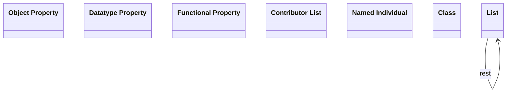

```mermaid
	classDiagram

    
    class `Object Property` {
    
    }

    class `Datatype Property` {
    
    }

    class `Functional Property` {
    
    }

    class `Contributor List` {
    
    }

    class `Named Individual` {
    
    }

    class `Class` {
    
    }

    class `List` {
    
    }


`List`  --> `List`   :first  

`List`  --> `List`   :rest  

```