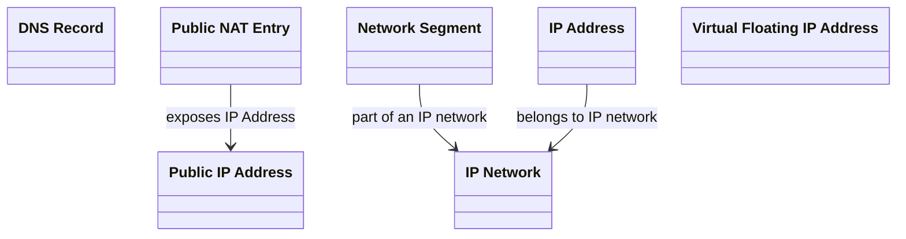

```mermaid
	classDiagram

    
    class `DNS Record` {
    
    }

    class `Public IP Address` {
    
    }

    class `IP Network` {
    
    }

    class `Public NAT Entry` {
    
    }

    class `IP Address` {
    
    }

    class `Network Segment` {
    
    }

    class `Virtual Floating IP Address` {
    
    }


`Network Segment`  --> `IP Network`   :part of an IP network  

`IP Address`  --> `IP Network`   :belongs to IP network  

`Public NAT Entry`  --> `Public IP Address`   :exposes IP Address  

```