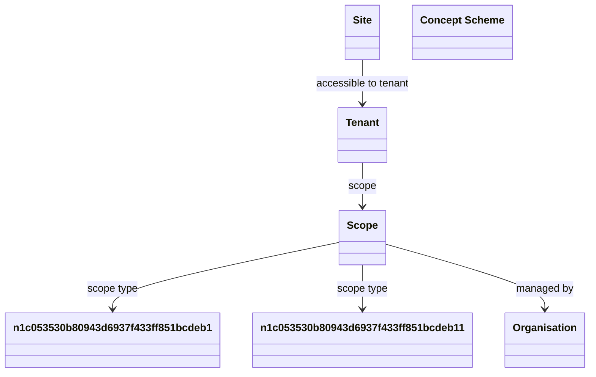

```mermaid
	classDiagram

    
    class `Tenant` {
    
    }

    class `Scope` {
    
    }

    class `Site` {
    
    }

    class `Organisation` {
    
    }

    class `Concept Scheme` {
    
    }

    class `n1c053530b80943d6937f433ff851bcdeb1` {
    
    }

    class `n1c053530b80943d6937f433ff851bcdeb11` {
    
    }


`Tenant`  --> `Scope`   :scope  

`Scope`  --> `n1c053530b80943d6937f433ff851bcdeb1`   :scope type  

`Site`  --> `Tenant`   :accessible to tenant  

`Scope`  --> `n1c053530b80943d6937f433ff851bcdeb11`   :scope type  

`Scope`  --> `Organisation`   :managed by  

```