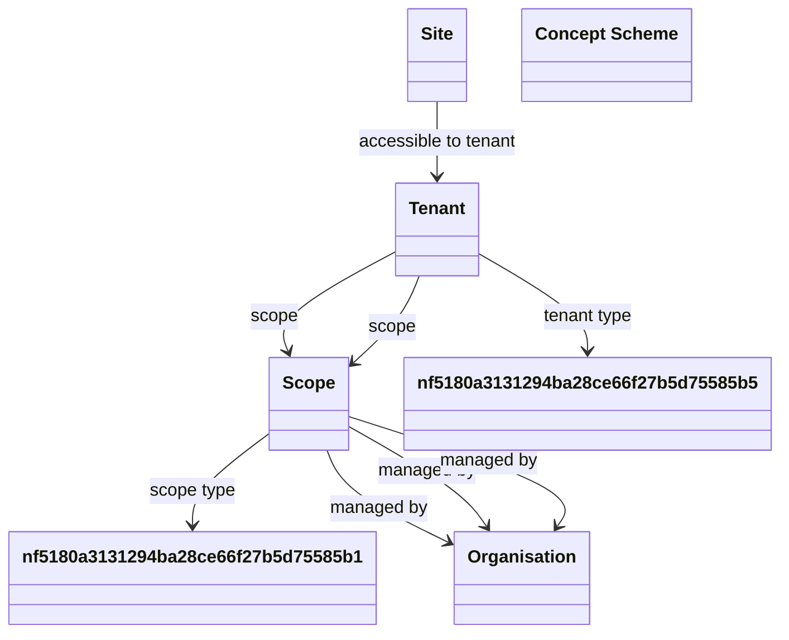

```mermaid
	classDiagram

    
    class `Tenant` {
    
    }

    class `Scope` {
    
    }

    class `Site` {
    
    }

    class `Organisation` {
    
    }

    class `Concept Scheme` {
    
    }

    class `nf5180a3131294ba28ce66f27b5d75585b1` {
    
    }

    class `nf5180a3131294ba28ce66f27b5d75585b5` {
    
    }


`Scope`  --> `nf5180a3131294ba28ce66f27b5d75585b1`   :scope type  

`Scope`  --> `Organisation`   :managed by  

`Site`  --> `Tenant`   :accessible to tenant  

`Tenant`  --> `nf5180a3131294ba28ce66f27b5d75585b5`   :tenant type  

`Tenant`  --> `Scope`   :scope  

`Scope`  --> `Organisation`   :managed by  

`Scope`  --> `Organisation`   :managed by  

`Tenant`  --> `Scope`   :scope  

```