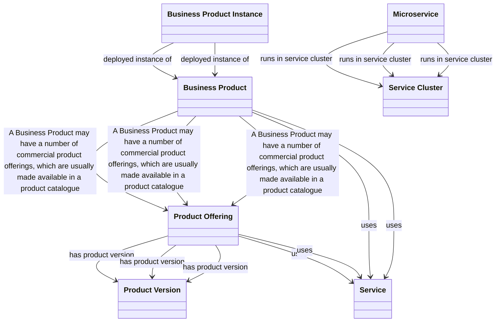

```mermaid
	classDiagram

    
    class `Product Offering` {
    
    }

    class `Microservice` {
    
    }

    class `Business Product` {
    
    }

    class `Service` {
    
    }

    class `Product Version` {
    
    }

    class `Service Cluster` {
    
    }

    class `Business Product Instance` {
    
    }


`Product Offering`  --> `Product Version`   :has product version  

`Business Product`  --> `Product Offering`   :A Business Product may have a number of commercial product offerings, which are usually made available in a product catalogue  

`Microservice`  --> `Service Cluster`   :runs in service cluster  

`Product Offering`  --> `Product Version`   :has product version  

`Product Offering`  --> `Product Version`   :has product version  

`Microservice`  --> `Service Cluster`   :runs in service cluster  

`Microservice`  --> `Service Cluster`   :runs in service cluster  

`Business Product`  --> `Product Offering`   :A Business Product may have a number of commercial product offerings, which are usually made available in a product catalogue  

`Business Product`  --> `Product Offering`   :A Business Product may have a number of commercial product offerings, which are usually made available in a product catalogue  

`Business Product Instance`  --> `Business Product`   :deployed instance of  

`Business Product Instance`  --> `Business Product`   :deployed instance of  

`Business Product`  --> `Service`   :uses  

`Product Offering`  --> `Service`   :uses  

`Product Offering`  --> `Service`   :uses  

`Business Product`  --> `Service`   :uses  

```