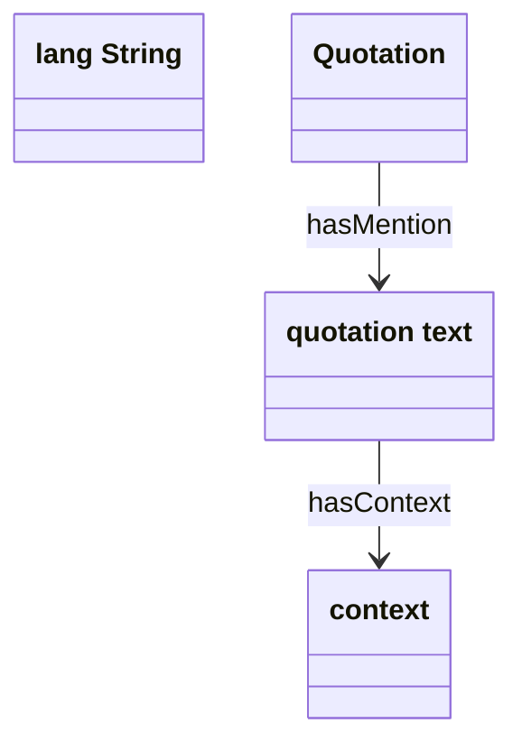

```mermaid
	classDiagram

    
    class `context` {
    
    }

    class `quotation text` {
    
    }

    class `lang String` {
    
    }

    class `Quotation` {
    
    }


`Quotation`  --> `quotation text`   :hasMention  

`quotation text`  --> `context`   :hasContext  

```