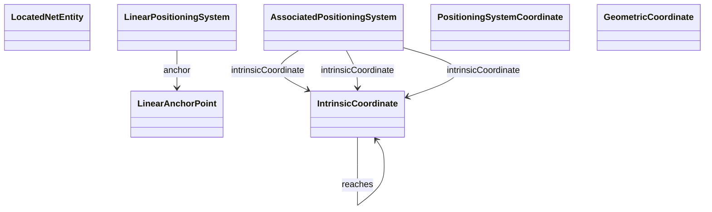

```mermaid
	classDiagram

    
    class `LocatedNetEntity` {
    
    }

    class `LinearPositioningSystem` {
    
    }

    class `LinearAnchorPoint` {
    
    }

    class `AssociatedPositioningSystem` {
    
    }

    class `PositioningSystemCoordinate` {
    
    }

    class `IntrinsicCoordinate` {
    
    }

    class `GeometricCoordinate` {
    
    }


`LinearPositioningSystem`  --> `LinearAnchorPoint`   :anchor  

`AssociatedPositioningSystem`  --> `IntrinsicCoordinate`   :intrinsicCoordinate  

`IntrinsicCoordinate`  --> `IntrinsicCoordinate`   :reaches  

`AssociatedPositioningSystem`  --> `IntrinsicCoordinate`   :intrinsicCoordinate  

`AssociatedPositioningSystem`  --> `IntrinsicCoordinate`   :intrinsicCoordinate  

```