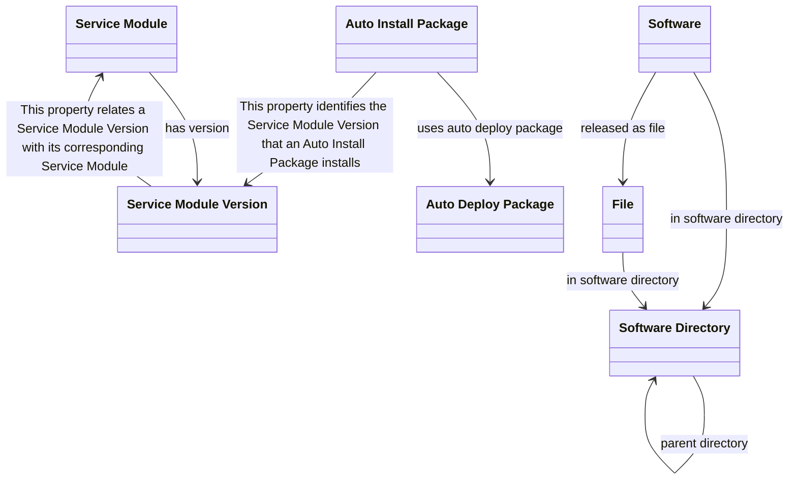

```mermaid
	classDiagram

    
    class `Software` {
    
    }

    class `Service Module` {
    
    }

    class `Software Directory` {
    
    }

    class `Service Module Version` {
    
    }

    class `File` {
    
    }

    class `Auto Deploy Package` {
    
    }

    class `Auto Install Package` {
    
    }


`Service Module`  --> `Service Module Version`   :has version  

`Auto Install Package`  --> `Auto Deploy Package`   :uses auto deploy package  

`Service Module Version`  --> `Service Module`   :This property relates a Service Module Version with its corresponding Service Module  

`Software`  --> `Software Directory`   :in software directory  

`Auto Install Package`  --> `Service Module Version`   :This property identifies the Service Module Version that an Auto Install Package installs  

`File`  --> `Software Directory`   :in software directory  

`Software`  --> `File`   :released as file  

`Software Directory`  --> `Software Directory`   :parent directory  

```