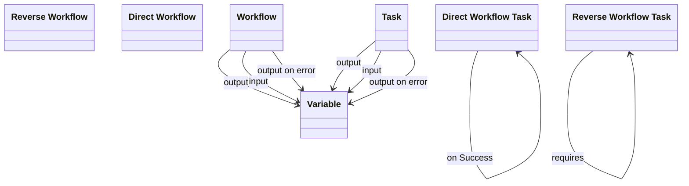

```mermaid
	classDiagram

    
    class `Reverse Workflow` {
    
    }

    class `Direct Workflow` {
    
    }

    class `Workflow` {
    
    }

    class `Variable` {
    
    }

    class `Task` {
    
    }

    class `Direct Workflow Task` {
    
    }

    class `Reverse Workflow Task` {
    
    }


`Reverse Workflow Task`  --> `Reverse Workflow Task`   :requires  

`Direct Workflow Task`  --> `Direct Workflow Task`   :on Error  

`Workflow`  --> `Variable`   :output  

`Task`  --> `Variable`   :output  

`Direct Workflow Task`  --> `Direct Workflow Task`   :on Complete  

`Direct Workflow Task`  --> `Direct Workflow Task`   :on Success  

`Workflow`  --> `Variable`   :input  

`Task`  --> `Variable`   :input  

`Workflow`  --> `Variable`   :output on error  

`Task`  --> `Variable`   :output on error  

```