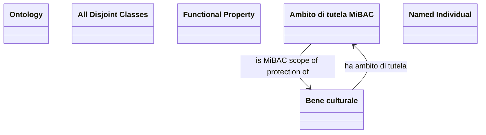

```mermaid
	classDiagram

    
    class `Ontology` {
    
    }

    class `All Disjoint Classes` {
    
    }

    class `Functional Property` {
    
    }

    class `Ambito di tutela MiBAC` {
    
    }

    class `Named Individual` {
    
    }


`Ambito di tutela MiBAC`  --> `Bene culturale`   :is MiBAC scope of protection of  

`Bene culturale`  --> `Ambito di tutela MiBAC`   :ha ambito di tutela  

```