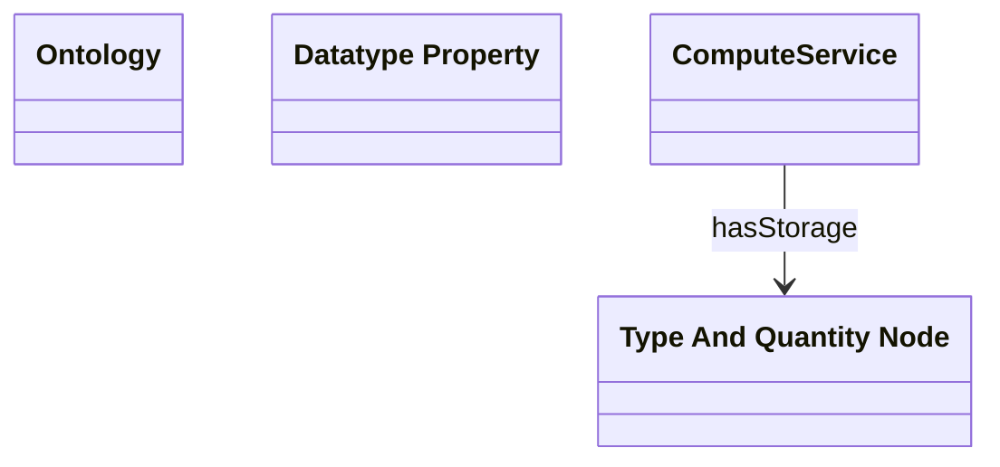

```mermaid
	classDiagram

    
    class `Ontology` {
    
    }

    class `Datatype Property` {
    
    }

    class `Type And Quantity Node` {
    
    }

    class `ComputeService` {
    
    }


`ComputeService`  --> `Type And Quantity Node`   :hasStorage  

```