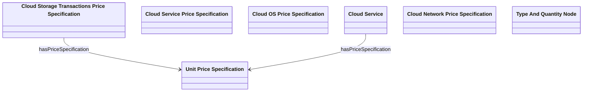

```mermaid
	classDiagram

    
    class `Cloud Service` {
    
    }

    class `Cloud Service Price Specification` {
    
    }

    class `Cloud OS Price Specification` {
    
    }

    class `Cloud Storage Transactions Price Specification` {
    
    }

    class `Cloud Network Price Specification` {
    
    }

    class `Type And Quantity Node` {
    
    }

    class `Unit Price Specification` {
    
    }


`Cloud Storage Transactions Price Specification`  --> `Unit Price Specification`   :hasPriceSpecification  

`Cloud Service`  --> `Unit Price Specification`   :hasPriceSpecification  

```