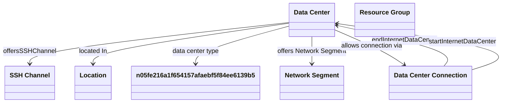

```mermaid
	classDiagram

    
    class `Data Center` {
    
    }

    class `Data Center Connection` {
    
    }

    class `Resource Group` {
    
    }

    class `SSH Channel` {
    
    }

    class `Location` {
    
    }

    class `n05fe216a1f654157afaebf5f84ee6139b5` {
    
    }

    class `Network Segment` {
    
    }


`Data Center`  --> `SSH Channel`   :offersSSHChannel  

`Data Center`  --> `Location`   :located In  

`Data Center Connection`  --> `Data Center`   :endInternetDataCenter  

`Data Center`  --> `n05fe216a1f654157afaebf5f84ee6139b5`   :data center type  

`Data Center`  --> `Network Segment`   :offers Network Segment  

`Data Center Connection`  --> `Data Center`   :startInternetDataCenter  

`Data Center`  --> `Data Center Connection`   :allows connection via  

```