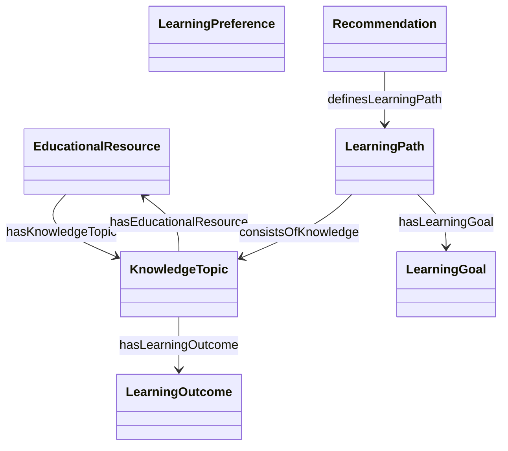

```mermaid
	classDiagram

    
    class `LearningGoal` {
    
    }

    class `EducationalResource` {
    
    }

    class `KnowledgeTopic` {
    
    }

    class `LearningPath` {
    
    }

    class `LearningPreference` {
    
    }

    class `LearningOutcome` {
    
    }

    class `Recommendation` {
    
    }


`EducationalResource`  --> `KnowledgeTopic`   :hasKnowledgeTopic  

`KnowledgeTopic`  --> `LearningOutcome`   :hasLearningOutcome  

`Recommendation`  --> `LearningPath`   :definesLearningPath  

`KnowledgeTopic`  --> `EducationalResource`   :hasEducationalResource  

`LearningPath`  --> `KnowledgeTopic`   :consistsOfKnowledge  

`LearningPath`  --> `LearningGoal`   :hasLearningGoal  

```