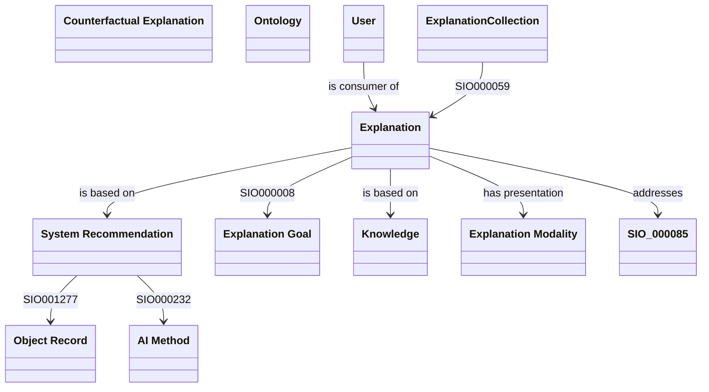

```mermaid
	classDiagram

    
    class `Counterfactual Explanation` {
    
    }

    class `Explanation` {
    
    }

    class `Ontology` {
    
    }

    class `System Recommendation` {
    
    }


`System Recommendation`  --> `Object Record`   :SIO001277  

`System Recommendation`  --> `AI Method`   :SIO000232  

`Explanation`  --> `Explanation Goal`   :SIO000008  

`Explanation`  --> `Knowledge`   :is based on  

`Explanation`  --> `System Recommendation`   :is based on  

`Explanation`  --> `Explanation Modality`   :has presentation  

`Explanation`  --> `SIO_000085`   :addresses  

`User`  --> `Explanation`   :is consumer of  

`ExplanationCollection`  --> `Explanation`   :SIO000059  

```