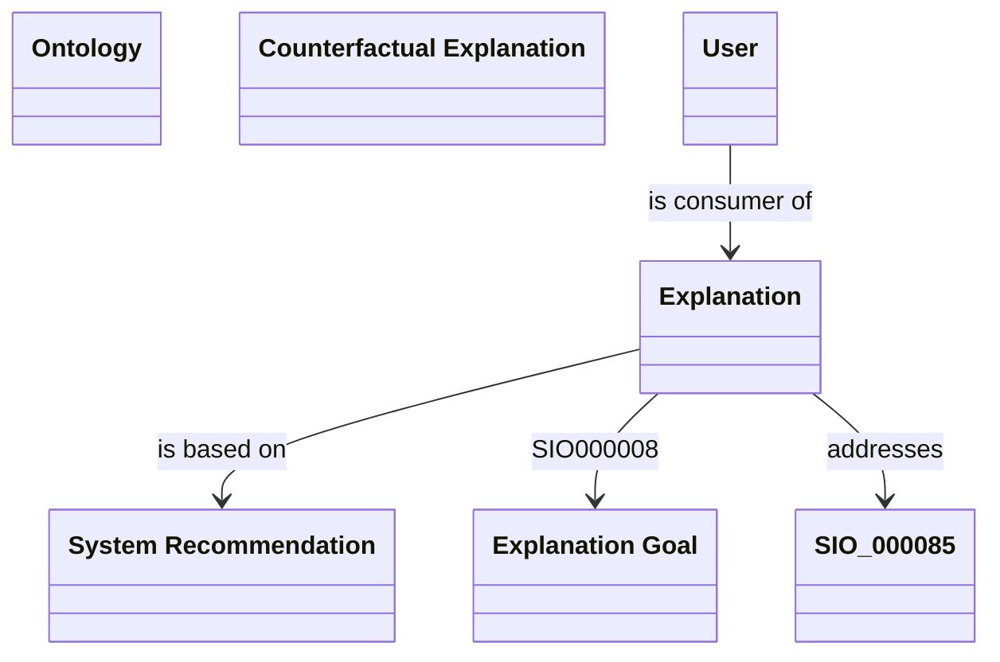

```mermaid
	classDiagram

    
    class `Ontology` {
    
    }

    class `Explanation` {
    
    }

    class `Counterfactual Explanation` {
    
    }

    class `System Recommendation` {
    
    }

    class `User` {
    
    }

    class `Explanation Goal` {
    
    }

    class `SIO_000085` {
    
    }


`Explanation`  --> `System Recommendation`   :is based on  

`User`  --> `Explanation`   :is consumer of  

`Explanation`  --> `Explanation Goal`   :SIO000008  

`Explanation`  --> `SIO_000085`   :addresses  

```