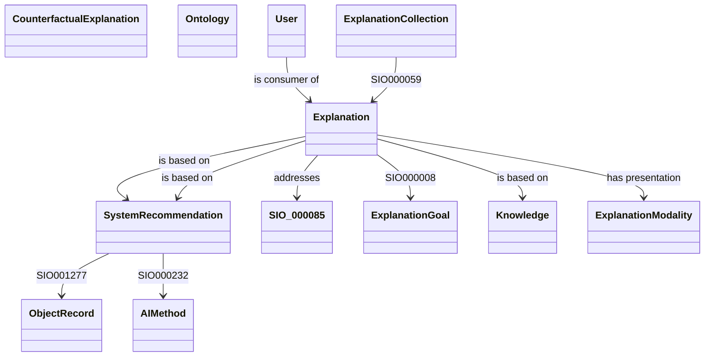

```mermaid
	classDiagram

    
    class Counterfactual Explanation {
    
    }

    class Ontology {
    
    }

    class Explanation {
    
    }

    class System Recommendation {
    
    }


Explanation  --> SIO_000085   :addresses  

User  --> Explanation   :is consumer of  

System Recommendation  --> Object Record   :SIO001277  

ExplanationCollection  --> Explanation   :SIO000059  

Explanation  --> Explanation Goal   :SIO000008  

Explanation  --> System Recommendation   :is based on  

Explanation  --> Knowledge   :is based on  

Explanation  --> System Recommendation   :is based on  

Explanation  --> Explanation Modality   :has presentation  

System Recommendation  --> AI Method   :SIO000232  

```