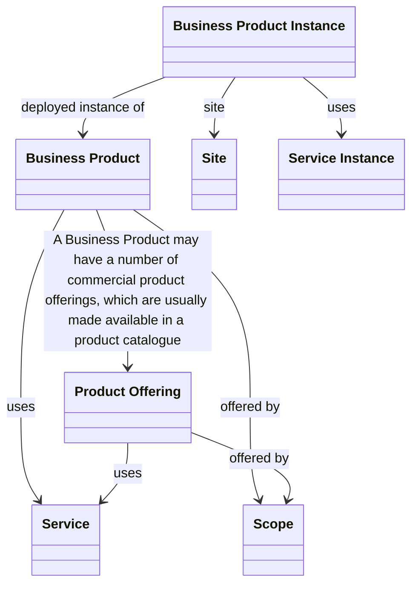

```mermaid
	classDiagram

    
    class `Product Offering` {
    
    }

    class `Business Product Instance` {
    
    }

    class `Business Product` {
    
    }

    class `Service` {
    
    }

    class `Scope` {
    
    }

    class `Site` {
    
    }

    class `Service Instance` {
    
    }


`Business Product`  --> `Service`   :uses  

`Business Product Instance`  --> `Site`   :site  

`Product Offering`  --> `Service`   :uses  

`Business Product Instance`  --> `Service Instance`   :uses  

`Business Product`  --> `Scope`   :offered by  

`Business Product Instance`  --> `Business Product`   :deployed instance of  

`Product Offering`  --> `Scope`   :offered by  

`Business Product`  --> `Product Offering`   :A Business Product may have a number of commercial product offerings, which are usually made available in a product catalogue  

```