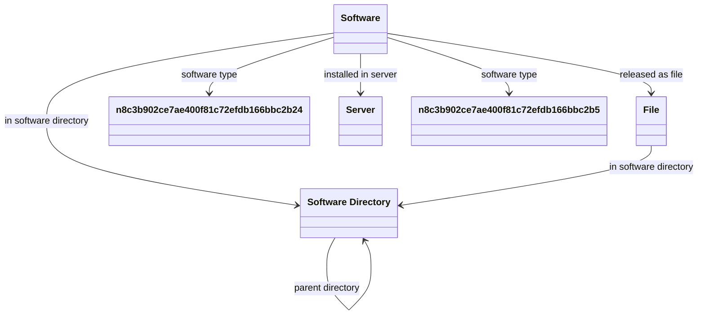

```mermaid
	classDiagram

    
    class `Software` {
    
    }

    class `Software Directory` {
    
    }

    class `File` {
    
    }

    class `n8c3b902ce7ae400f81c72efdb166bbc2b24` {
    
    }

    class `Server` {
    
    }

    class `n8c3b902ce7ae400f81c72efdb166bbc2b5` {
    
    }


`Software`  --> `File`   :released as file  

`Software Directory`  --> `Software Directory`   :parent directory  

`Software`  --> `n8c3b902ce7ae400f81c72efdb166bbc2b24`   :software type  

`Software`  --> `Software Directory`   :in software directory  

`Software`  --> `Server`   :installed in server  

`File`  --> `Software Directory`   :in software directory  

`Software`  --> `n8c3b902ce7ae400f81c72efdb166bbc2b5`   :software type  

```